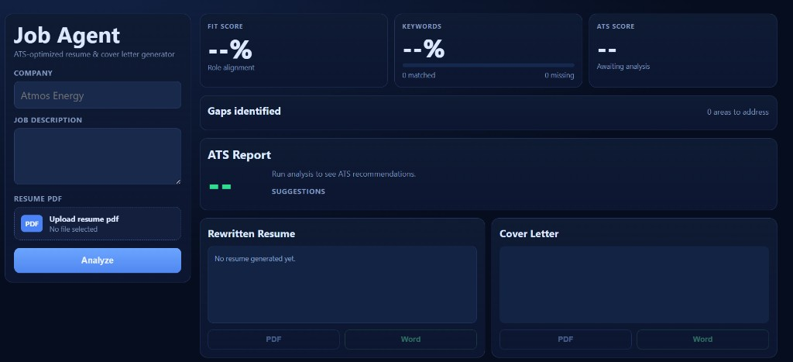

# Job Agent

ATS-optimized resume and cover letter generator powered by a multi-agent LLM pipeline.

## What It Does

- Parses a job description into structured hiring signals
- Scores resume-job fit with strengths, gaps, and positioning angles
- Rewrites resume content to align with the target role
- Generates a tailored cover letter
- Runs ATS-focused quality checks
- Exports resume and cover letter in PDF and Word (`.docx`)

## Refinements (recent)

- **Structured resume JSON** → rendered to consistent ATS markdown (`resume_structured` + `resume`)
- **Deterministic keyword stats** (`keyword_stats`) merged into the quality report
- **Optional fact-check** pass comparing original vs rewritten resume (`fact_check`)
- **Resume length preset**: one-page (tight) vs two-page (more detail) — form field `resume_preset`
- **JD parse cache** (in-memory) for repeated runs with the same JD text
- **OpenRouter retries** + optional **fallback model** IDs on 404
- **Platypus PDF** for resumes (cleaner typography than raw canvas)
- **UI**: pipeline progress overlay, original vs rewritten compare with JD keyword highlights, local run history
- **Tests**: `pytest` for keywords, resume render, and markdown blocks

## Tech Stack

- Backend: Python + Flask
- LLM routing: OpenRouter API
- Parsing: `PyPDF2`
- Document export: `reportlab` (PDF), `python-docx` (Word)
- Frontend: HTML/CSS/JS dashboard

## Project Structure

```text
job-agent/
├── agents/
│   ├── jd_parser.py
│   ├── match_scorer.py
│   ├── resume_rewriter.py
│   ├── cover_letter.py
│   ├── quality_checker.py
│   └── fact_check.py
├── utils/
│   ├── openrouter.py
│   ├── pdf_parser.py
│   ├── keywords.py
│   ├── resume_render.py
│   ├── resume_blocks.py
│   ├── pdf_export.py
│   ├── cache.py
│   ├── json_llm.py
│   └── quality_merge.py
├── tests/
├── frontend/
│   └── index.html
├── orchestrator.py
├── app.py
├── requirements.txt
└── .env.example
```

## Architecture (Pipeline)

1. `jd_parser` -> extracts role title, keywords, skills, tone, and responsibilities
2. `match_scorer` -> evaluates fit and identifies gaps
3. `resume_rewriter` -> rewrites resume in ATS-friendly structure
4. `cover_letter` -> writes role/company-specific cover letter
5. `quality_checker` -> returns ATS score and improvement suggestions

The orchestrator (`orchestrator.py`) runs these steps sequentially and returns a unified JSON response.

## Setup

### 1) Clone

```bash
git clone https://github.com/gayu56/job-agent.git
cd job-agent
```

### 2) Install dependencies

```bash
pip install -r requirements.txt
```

### 3) Configure environment

Create a `.env` file in `job-agent/` using `.env.example`:

```bash
OPENROUTER_API_KEY=your-openrouter-key
OPENROUTER_MODEL_FAST=anthropic/claude-3.5-haiku
OPENROUTER_MODEL_STRONG=anthropic/claude-3.5-sonnet
# Optional fallbacks / retries — see job-agent/.env.example
```

### Tests

```bash
cd job-agent
pytest tests -q
```

## Run Locally

```bash
python app.py
```

Open:

- `http://127.0.0.1:5000/`

## API Endpoints

### `POST /analyze`

Analyzes resume + JD and returns:

- `jd_analysis`
- `match_score`
- `resume` (markdown)
- `resume_structured` (JSON sections)
- `original_resume_excerpt` (first ~4k chars for UI compare)
- `cover_letter`
- `quality_report` (includes merged `keyword_coverage_percent` / `missing_keywords` from deterministic stats)
- `keyword_stats` (`coverage_percent`, `matched`, `missing`)
- `fact_check` (if enabled)
- `meta` (`preset`, `jd_cache_hit`, `steps`)

Input (form-data):

- `company` (required)
- `jd_text` (required)
- `resume_text` (optional if `resume_pdf` provided)
- `resume_pdf` (optional if `resume_text` provided)
- `resume_preset`: `one_page` | `two_page`
- `fact_check`: `true` | `false`

### `POST /export`

Exports generated content as PDF or Word.

Input (form-data):

- `type`: `resume` or `cover_letter`
- `format`: `pdf` or `docx`
- `company`
- `content`

## UI Highlights

- Left input panel for company, JD, and resume upload
- Right-side analytics dashboard:
  - Fit score
  - Keyword coverage
  - ATS score
  - Gaps and suggestions
- Download buttons for:
  - Resume -> PDF / Word
  - Cover letter -> PDF / Word

## UI Preview



## Notes

- `.env` is git-ignored by default.
- If a model returns 404 from OpenRouter, switch model IDs in `.env`.
- For best outputs, use detailed job descriptions and resume text with metrics.
